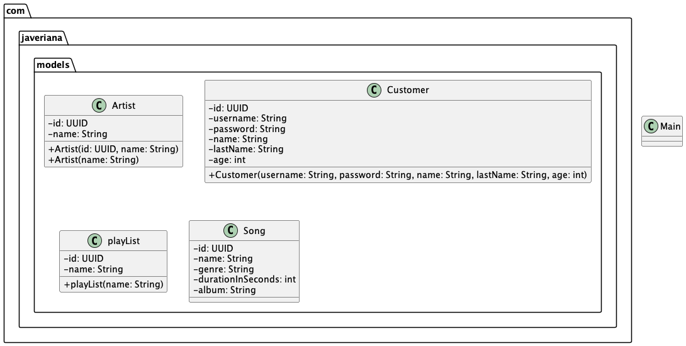

# Taller 6 - Primeros pasos en Java

En este taller se trabajará en la creación de clases en Java. Se espera que el estudiante comprenda la creación de clases, atributos, constructores y métodos en Java.


## Indice

1. [Preguntas teóricas](#preguntas-teóricas)
2. [Enunciado](#enunciado)
    1. [Paquete Models](#paquete-models)
        1. [Clase `Artist`](#clase-artist)
        2. [Clase `Customer`](#clase-customer)
        3. [Clase `PlayList`](#clase-playlist)
        4. [Clase `Song`](#clase-song)
    2. [Clases sin paquete](#clases-sin-paquete)
        1. [Clase `Main`](#clase-main)
3. [Calificación](#calificación)
4. [¿Qué sigue?](#qué-sigue)
5. [Recursos en línea](#recursos-en-línea)

## Preguntas teóricas

Marque la respuesta correcta a las siguientes preguntas. Estas preguntas no afectan la calificación del taller, pero le ayudarán a reforzar los conceptos vistos en clase:

1. Un objeto se compone de:
    - Parámetros y métodos
    - Estado y comportamiento
    - Estado y atributos
    - Métodos y comportamiento
2. Un método es:
    - Una forma de encapsular un grupo de atributos
    - Una forma de hacer la asociación entre clases
    - Una propiedad de un atributo, que permite que se mantenga actualizado
    - Una técnica de programación orientada a objetos
    - Ninguna de las anteriores
3. ¿Cuál de las siguientes afirmaciones es falsa?
    - Cada método define un comportamiento de los objetos de una clase.
    - Un método puede aceptar parámetros.
    - Los métodos pueden invocar otros métodos en otros objetos
    - Un método puede declarar atributos
    - Un método contiene instrucciones para ser ejecutadas
4. Los métodos `public` se pueden acceder:
    - Únicamente dentro de la misma clase que los define
    - Únicamente dentro de los métodos constructores de la clase
    - Únicamnte sobre objetos transitivos
    - Desde fuera de la clase que los define
5. Si no se indica un modificador de acceso en un método, ¿cuál es el modificador de acceso por defecto?
    - `public`
    - `private`
    - `protected`
    - `default`
6. ¿Desde dónde se puede acceder a un método `default`?
    - Desde cualquier clase
    - Únicamente desde la misma clase
    - Desde cualquier clase del mismo paquete
    - Ninguna de las anteriores
7. ¿Qué es la variable `this` en Java?
    - Una variable que se utiliza para referenciar a la clase actual
    - Una variable que se utiliza para referenciar a la clase padre
    - Una variable que se utiliza para referenciar a la clase hija
    - Una variable que se utiliza para referenciar a la clase abuelo
8. ¿Para qué sirve la clase `Scanner` en Java?
    - Para leer datos del teclado
    - Para leer datos de un archivo
    - Para leer datos de un servidor
    - Para leer datos de una base de datos
9. El encapsulamiento de métodos consiste en:
    - Permitir el acceso a métodos privados únicamente a través de métodos públicos
    - Permitir el acceso a atributos privados únicamente a través de métodos privados
    - Permitir el acceso a métodos privados únicamente a través de métodos privados
    - Permitir el acceso a atributos privados únicamente a través de métodos públicos
10. ¿Cuál de las siguientes declaraciones de constructor son válidas para la clase cuyo nombre es `Moneda`?
    - `public void Moneda()`
    - `public Moneda()`
    - `private void Moneda()`
    - `private Moneda Moneda()`
    - `public Moneda Moneda()`

11. Suponga que tiene una clase Estudiante que no contiene ningún constructor. Al instanciar un objeto de la clase Estudiante, ¿qué constructor se ejecuta?
    - El constructor por defecto
    - El constructor que recibe parámetros
    - No se puede instanciar un objeto de la clase Estudiante
    - El constructor que recibe parámetros y el constructor por defecto
12. ¿Para qué sirve el operador **`new`** en java?
    - Para crear un nuevo objeto de una clase
    - Para llamar a un método
    - Para crear un nuevo atributo
    - Para llamar a un constructor
13. ¿Cuál de las siguientes afirmaciones es correcta?
    - Un objeto es una instancia de una clase
    - Un método es una instancia de un objeto
    - Un método es una instancia de un objeto
    - Un atributo es una instancia de una clase
14. ¿Cuál de los siguientes enunciados es verdadero sobre los constructores?
    - Es obligatorio que toda clase tenga un constructor explícito
    - Un constructor permite declarar una variable cuyo tipo corresponde a una clase
    - Todo constructor debe recibir parámetros para inicializar atributos
    - Es necesario inicializar todos los atributos en el constructor, de lo contrario podrían contener valores no válidos
    - Un constructor inicializa el estado de un objeto y permite retornar un objeto de la clase en la cual está definido
15. Una clase **A** puede tener un atributo que es de tipo **A**.
    - Verdadero
    - Falso
16. En Java el constructor de una clase se llama automáticamente cuando se encuentra la declaración de la clase.
    - Verdadero
    - Falso
17. En Java se pueden definir varios constructores para una clase. La única restricción es que los constructores deben tener diferente número de parámetros.
    - Verdadero
    - Falso
18. En Java se pueden crear apuntadores a objetos.
    - Verdadero
    - Falso
19. Un método puede acceder y modificar cualquier atributo de la clase en la que se define, independientemente del modificador de acceso que tenga el atributo.
    - Verdadero
    - Falso
20. Si la clase A tiene como atributo un String ¿Cuál es el valor del atributo de tipo String luego de ejecutar el constructor por defecto?
    - null
    - ""
    - " "
    - "null"
21. ¿Cuáles son los 4 pilares de la programación orientada a objetos?
    - Encapsulamiento, herencia, polimorfismo y abstracción
    - Encapsulamiento, herencia, polimorfismo y encapsulación
    - Encapsulamiento, herencia, polimorfismo y composición
    - Encapsulamiento, herencia, polimorfismo y abstracción
22. ¿Cuál es la diferencia entre una clase y un objeto?
    - Una clase es un objeto y un objeto es una clase
    - Una clase es una plantilla y un objeto es una instancia de una clase
    - Una clase es una instancia de un objeto y un objeto es una plantilla
    - Una clase es un objeto y un objeto es una plantilla
23. ¿Qué es la jvm?
    - Es un intérprete de Java. Se encarga de cargar, verificar, interpretar y ejecutar el bytecode creado en Java.
    - Es un compilador de Java. Se encarga de compilar el código fuente de Java a bytecode.
    - Es un editor de Java. Se encarga de escribir y ejecutar el código fuente de Java.
    - Es un depurador de Java. Se encarga de depurar el código fuente de Java.
24. Los diferentes tipos de datos en java son primitivos y objetos. Esta afirmación es:
    -  Verdadera
    -  Falsa
25. En java se pueden declarar apuntadores. Esta afirmación es:
    -  Verdadera
    -  Falsa
26. ¿Qué son los paquetes en Java?
    -  Son directorios que contienen clases relacionadas
    -  Son clases que contienen métodos y atributos
    -  Son clases que contienen métodos y atributos estáticos
    -  Son directorios que contienen clases no relacionadas
27. El valor por defecto de un atributo de tipo float es 0. Esta afirmación es:
    -  Verdadera
    -  Falsa
28. Los valores por defecto en java aplican a cualquier variable creada en el programa. Esta afirmación es:
    -  Verdadera
    -  Falsa
29. ¿Qué es el constructor de una clase?
    -  Es un método que se llama automáticamente cuando se crea un objeto de la clase
    -  Es un método que se llama automáticamente cuando se destruye un objeto de la clase
    -  Es un método que se llama automáticamente cuando se modifica un objeto de la clase
    -  Es un método que se llama automáticamente cuando se inicializa un objeto de la clase
30. Si no se provee un constructor en una clase el código no compilará. Esta afirmación es:
    -  Verdadera
    -  Falsa

[Volver al índice](#indice)

## Enunciado

A continuación se presenta la documentación del proyecto de una aplicación de música. Va a encontrar una explicación detallada de las clases que deben existir en el proyecto.
Este es el primer taller y se espera que se realice en parejas. También, este será el proyecto base para el taller 7.

El primer paso es descargar o clonar el proyecto de este repositorio. Luego, abrirlo en un IDE (preferiblemente Intellij) y empezar a trabajar en él. Recuerde que debe tener instalado java 17.

Una vez que haya abierto el proyecto, se crearán las clases necesarias para trabajar en el proyecto. Cada una de estas clases deberán estar en el paquete que se le indique.

### Paquetes

#### Paquete model

El paquete `model` contiene las clases que representan las entidades principales de la aplicación de música.
Una entidad, en el contexto de la programación y el desarrollo de software, se refiere a un objeto o concepto que es identificable.
En términos simples, una entidad es una instancia única de un objeto.
En este programa, las entidades son: Artist, Customer, PlayList y Song.



[Volver al índice](#indice)

##### Clase `Artist`:

La clase `Artist` representa un artista en una aplicación de música.

###### Atributos

La clase `Artist` tiene dos atributos:

1. `id`: Este atributo es una instancia de la clase `UUID`. Se utiliza para identificar de manera única cada instancia de `Artist`.

2. `name`: Este atributo es una cadena que representa el nombre del artista.

###### Constructores

La clase `Artist` tiene dos constructores:

1. `public Artist(UUID id, String name)`: Este constructor crea un objeto `Artist` con el `id` y `name` proporcionados.

2. `public Artist(String name)`: Este constructor crea un objeto `Artist` con el `name` proporcionado. El `id` se genera automáticamente.

[Volver al índice](#indice)

##### Clase `Customer`

La clase `Customer` representa un cliente en una aplicación de música.

###### Atributos

La clase `Customer` tiene seis atributos:

1. `id`: Este atributo es una instancia de la clase `UUID`. Se utiliza para identificar de manera única cada instancia de `Customer`.

2. `username`: Este atributo es una cadena que representa el nombre de usuario del cliente.

3. `password`: Este atributo es una cadena que representa la contraseña del cliente.

4. `name`: Este atributo es una cadena que representa el nombre del cliente.

5. `lastName`: Este atributo es una cadena que representa el apellido del cliente.

6. `age`: Este atributo es un entero que representa la edad del cliente.

###### Constructores

La clase `Customer` tendrá dos constructores, de momento se implementará solo uno de ellos:

1. `public Customer(String username, String password, String name, String lastName, int age)`: Este constructor crea un objeto `Customer` con el `username`, `password`, `name`, `lastName` y `age` proporcionados. El `id` se genera automáticamente.

[Volver al índice](#indice)

#### Clase Playlist

La clase `Playlist` representa una lista de reproducción en una aplicación de música.

###### Atributos

La clase `Playlist` tiene dos atributos:

1. `id`: Este atributo es una instancia de la clase `UUID`. Se utiliza para identificar de manera única cada instancia de `PlayList`.

2. `name`: Este atributo es una cadena que representa el nombre de la lista de reproducción.

###### Constructores

La clase `Playlist` tiene dos constructores, de momento se implementará solo uno de ellos:

1. `public Playlist(String name)`: Este constructor crea un objeto `PlayList` con el `name` proporcionado. El `id` se genera automáticamente.


[Volver al índice](#indice)

##### Clase Song

La clase `Song` representa una canción en una aplicación de música.
###### Atributos

La clase `Song` tiene seis atributos:

1. `id`: Este atributo es una instancia de la clase `UUID`. Se utiliza para identificar de manera única cada instancia de `Song`.

2. `name`: Este atributo es una cadena que representa el nombre de la canción.

3. `genre`: Este atributo es una cadena que representa el género de la canción.

4. `durationInSeconds`: Este atributo es un entero que representa la duración de la canción en segundos.

5. `album`: Este atributo es una cadena que representa el álbum de la canción.

###### Constructores

La clase `Song` tendrá dos constructores, de momento se implementará uno de ellos:

1. `public Song(String name, String genre, int durationInSeconds, String album)`: Este constructor crea un objeto `Song` con el `name`, `genre`, `durationInSeconds` y `album` proporcionados. El `id` se genera automáticamente.

[Volver al índice](#indice)

## Clases sin paquete

### Clase `Main`

La clase `Main` es la clase principal de la aplicación de música. Contiene el método `main` que se ejecuta cuando se inicia la aplicación.

El método `main` debe realizar las siguientes acciones:

1. Crear un objeto de la clase `Artist` con el nombre que el cliente le indique.
2. Crear un objeto de la clase `Customer` con los datos que el cliente le indique.
3. Crear un objeto de la clase `Playlist` con el nombre que el cliente le indique.
4. Crear un objeto de la clase `Song` con los datos que el cliente le indique.

En todos los casos, los datos que el cliente le indique deben ser ingresados por consola con excepción del `id` que se generará automáticamente.

[Volver al índice](#indice)

## Prueba de que mis clases están correctamente definidas

Para verificar que las clases solicitadas están correctamente definidas, 
se debe ejecutar el siguiente comando en la terminal de su IDE:

```bash
./gradlew build
```

Este comando compilará el proyecto y ejecutará las pruebas definidas en el proyecto.
Si las clases están correctamente definidas, las pruebas pasarán exitosamente. En caso contrario, se mostrará un mensaje de error, indicándole qué falló.

**El hecho de que las pruebas pasen no garantiza que la implementación esté correcta, solamente que cumple con la estructura solicitada.**
## Calificación

El programa debe compilar y ejecutar sin errores. Se debe cumplir con los siguientes requerimientos:

1. Las clases deben estar en los paquetes indicados.(0.5)
2. Las clases deben tener los atributos y constructores indicados. (1.0)
3. Todas las clases del paquete `models` deben tener getters para todos los atributos y setters para todos con excepción del atributo `id`. (1.0)
4. Todas las clases del paquete `models` deben implementar el método `toString` que devuelva una cadena de caracteres (String) con el siguiente formato (1.0):
    ```
   <Atributo1>: <Valor1> - <Atributo2>: <Valor2> ... <AtributoN>: <ValorN>
   ``` 
5. El programa debe solicitar los datos al cliente por consola. (0.5)
6. La clase `Main` debe permitir crear cada uno de los objetos por medio de un menú e imprimirlo en pantalla. (1.0)

**Este taller es la base de su proyecto. Los posteriores talleres no se calificarán hasta que se haya completado este.
Si todo está correcto, sumará 0.5 a su proyecto final.
Este taller debe ser entregado durante la semana 9**

## ¿Qué sigue?

Como puede darse cuenta, ninguna de las clases está relacionada entre sí. En el siguiente taller se trabajará en la relación entre las clases y se implementarán métodos que permitan realizar acciones con los objetos creados.

## Recursos en línea

- [Instalar Java 22 o versiones anteriores en Windows mediante Temurin](https://www.youtube.com/watch?v=nFTsq8Q3Q-o) [Video]
- [Cómo instalar y desinstalar el JDK de Java 22 en macOS](https://www.youtube.com/watch?v=47AeOQJCV6s) [Video]
- [¿Para qué sirve el modificador static de Java?](https://www.youtube.com/watch?v=044vXkXypcU) [Video]
- [Getters y setters o atributos públicos en Java, ¿qué es mejor?](https://www.youtube.com/watch?v=gXvnHialu0s) [Video]
- [toString en Java ☕ Viendo el estado de los objetos 👀](https://www.youtube.com/watch?v=r9rxz63p4XQ) [Video]
- [Introducción al Scanner de Java](https://www.youtube.com/watch?v=nvHVzPfdrAQ) [Video]
- [Java Data Types](https://www.geeksforgeeks.org/data-types-in-java/) [Artículo]
- [Java OOP Concepts](https://www.geeksforgeeks.org/object-oriented-programming-oops-concept-in-java/) [Artículo]
- [Java Constructors](https://www.geeksforgeeks.org/constructors-in-java/) [Artículo]
- [Package in Java](https://www.geeksforgeeks.org/packages-in-java/) [Artículo]
- [Java null](https://www.baeldung.com/java-null) [Artículo]
